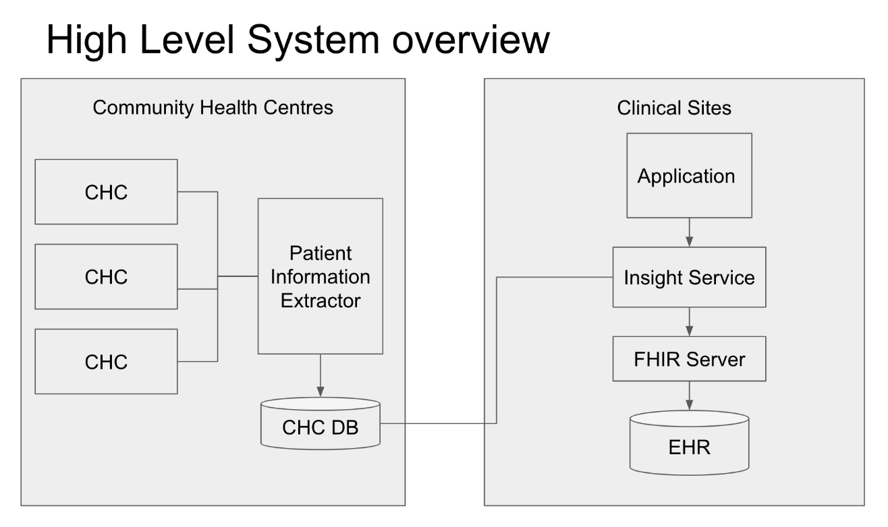
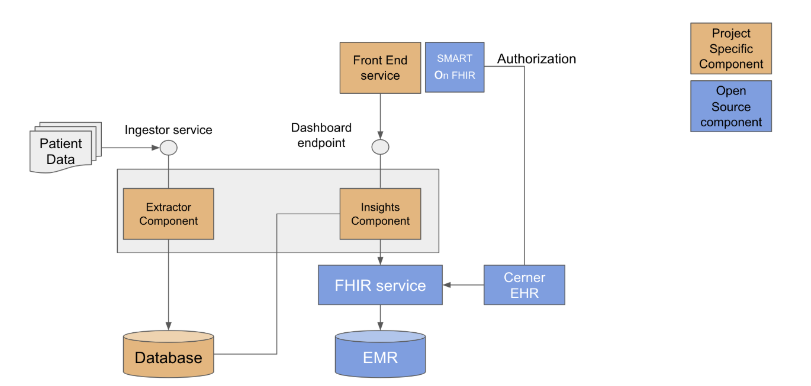
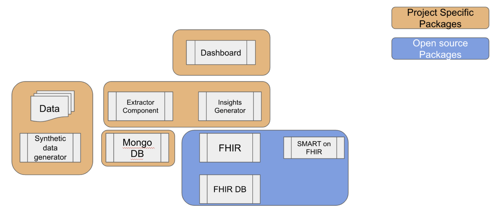

## Integrating Insights from Unstructured Community Data into EHRs
 
####Project Name: Integrating Insights from Unstructured Community Data into EHRs

This document is present under Documentation folder under the directory FinalDelivery

### __Premable:__
CHC are been found effective in improving public health. However, the software system used by those programs face significant barriers ito integrate the data into clinical systemsm like EHR, since the data is mostly unstructured. There are efforts being made to bridge the barriers. However, these are still in thier infancy and would take considerable lead time before they get adopted by social service organisations. There is a need to develop solutions to analyze this unstrucured data, combine this with data present(if any) with the Clinical data systems (like EHR) and present to the service provider. 
This project is one such initiative in this direction.

###Objective: 
Develop software system that can take an unstructured data, extract menanigful information from it, relate to the data present in the EHRs and present this in an actionable way that can be consumed by the health care provider.

###High level requirements:
(for detailed requirements see Appendix A)
Develop pacakge that can intrepret Unstructured data coming from CHC. it should be possible to extract the following
Patient name
Age, 
Gender, 
Observations - like  Weight, Height, HB1AC, BP
Capability to derive  “intelligence” from this data extracted (e.g. trend)
Software package should have the ability to combine this data with the clinical data (e.g. EHR). (Usage of FHIR server to get the data from EHR is mandatory)
Render the combined information in a dashboard that can be consumed by the medical practioner in a meaningful way.(Use of SMART on FHIR is preferred)

The following figure shows the high level system overview.

The data (typically unstructured, non-standard) comes from the CHC (community Health centres). The Patient information extractor takes the input data generated from the CHCs and extracts relevant information and stores the data into a structured database. 
At the clinical site, when the healthcare provider uses an application to pull relevant information for a patient, then the “combiner service” would combine the data for that specific patient, from EHR and CHC DB, derive “intelligence” and visualize in the dashboard. 

### High level approach:
1. __Data__.  
The first and important step was to get the data - since without knowing the data and its format, it would be difficult to do ETL, derive intelligence etc. 
Our Mentor provided us a synthetic code generator which could generate the data from here ( https://github.com/johnnybender/synthetic-ph ) We took this as a starter and modified this to generate more patient data and multiple encounters.

2. __Architecture__  
The following figure below shows the high level architecture of the project.  
The components that are developed are shown in Orange colur and the open source components used are shown in the Blue colour.

The Extractor component exposes a REST API Ingestion API using which the data can be ingested. This component extracts the information from the incoming unstructured data and stores this in a Mongo Database. (see why this technology was chosen in the Technology selection section).  
The application uses the SMART on FHIR library to get the user authorised on FHIR.  
The Insights generator component will look for the corresponding patient in the FHIR database and also combine the data/observations from the MongoDB, thus eventually showing the combined information in the dashboard for the end user. 

3. __Technology  choices__  
__Exposing REST endpoint for ingestion:__
We expose a HTTP REST end point for ingesting the data making it flexible to write the ingestor program (to ingest the data into our service) in any programing language. 
Used MongoDB to store the CHC data into a data base.   
Since __MongoDB__ is a document oriented database, it allows any data model ( CHC ‘A’ may collect certain observations in an encounter while CHC ‘B’ may not. It could also be that the CHC A may run different Community programs at different times and the observations collected will be different in each such program).  
We used __FHIR__ to convert all the observations into a standard format. 
In this way, all observations collected by various CHCs, can be ‘converted’ in to a standard data model, eventually leading to a standard visualisation to the health care provider (clinician) irrespective of from which CHC the data has come from
__SMART on FHIR__.  
This helps in easily integrating our service as a plug-in for FHIR based applications. We used __CERNER__ based library to achieve this - this supports an easy way to select the patient (after authorising the user onto the relevant FHIR service using OAuth tokens).   

4. __ETL/Extractor__  
One of the requriement was to interpret the unsrtuctured data. A couple of techniques were used to interpret what the columns could mean.  
Took care of potential variations in the column names. For e.g. columns with name Weight and wt were searched for.
For the date, the programing logic tried to extract date in multiple formats (since the date format can be in different style - for e,g, 25th Dec 1998 can be represented as 25/12/1998, or 12/25/1998 or 1998-12-25 or Friday, 25th Dec 1998 etc. The ETL logic takes care of all these diff formats).    
For certain observations - e.g. HBA1C -the ETL logic checks whether the values are valid by comparing the value between lower threshold and upper threshold. In this case between 2 and 16)

4. __Open source libraries__.  
The following are the open source libraries that we have.  
1) SMART.  
2) FHIR Sever.  
3) SMART on FHIR.  
4) OAuth (as part of the SMART)

5. __Deployment and packaging__.  
Used the HDAP for building, CI/CD and deployment.  
The following figure shows the packages developed as part of this project

There are __5 packages__ out of which 4 packages were developed as part of this project.  
__Data generator:__ This package was used to generate the data. (In the Git, you will see this as __datagenerator__ folder).    

__Extractor/Insights generator component:__ 
The extractor package extracts the information from the incoming data and stores the information in the Mongodb. 
The __Insights generator__ component combines the data from the FHIR database and from the MongoDB. This exposes an API for the dashboard. (In the Git, this component is called as __ingest__).

__Database__: This package provides functionality to store and retrieve the structured CHC data. (In the git this is present as __schemas__).  

__Dashboard:__ This is a thin client visualisation page that renders the information coming from the underlying Insights Generator component. (In the Git, this is called as __web__)
__FHIR:__ This package hosts the FHIR DB, Cerner’s SMART on FHIR App and a FHIR server. (open source libraries)

####Appendix A:

Detailed Requirements (as agreed with Mentor - Johnny Bender).  
__Build & deploy a web server__ 
Can leverage open source code
smart-on-fhir/web-server 
Gut it and only use the stuff we need (i.e. fhir formatting)
Should have (at least) two endpoints 
INGESTION  endpoint-  One that receives a csv file as input, extracts insights from the file and stores them in a db
Our insights are comprised of with 3 (or just 2) primary data types
Date of the encounter
Measurements taken
i.e. BMI
(OPTIONAL) trends
We will probably need to extract a few more data points
Assuming one CSV per facility => store the facility/location name
I believe we can make up (hopefully silly) names
i.e.   Mordor Medical Center
Patient ID 
Needed to match patients within the same file
DB should store the insights in the fhir format using an the appropriate data types (links in slack)
Dates are a part of a ‘procedure’
Measurements are a part of an ‘observation’
Trends - not clear which fhir object this would be a part of. John suggested observation.
Patient is something we will also need
All of the data that we will  be receiving will be in CSV
We should leverage the tool that John created to generate synthetic data but we need to…
Generate random values
i.e. Weight could have a random value between 50 - 500 lbs
Randomize the column headers (labels)
i.e. The Weight columns header can be: ‘weight’, ‘WEIGHT’, ‘wt’...etc
Randomly omit columns
Client matching for ingestion
No two files will share patients, facilities or anything else
The first time a patient appears in the CSV file, should be treated as a new patient
Multiple rows within the same CSV file should be handled as multiple encounters for the same patient
Accuracy is not important
50% accuracy would suffice
Accuracy of what, or how we would measure it is not clear.  So I think we should not put too much emphasis on this in general.
QUERY endpoint- would allow a web based front-end to query the db. This can be made of more than one end-point.
Allow querying by patient ID
Assume the user is already authenticated
We can hardcode (in the front-end) the user ID used to query 
In this way our UI will always show data, but theoretically the back-end could be used to query for other users
Client matching with external systems is not in scope

Build a JS/HTML/CSS front-end that will display the data in a useful format
I took John’s feedback to mean that he would like for us to take initiative and design our own UI
It must be integrated with cerner
I believe that SMART/ OAuth is required here but I’m not 100% 

###Appendix B:
Dashboard template shared by Mentor.  

