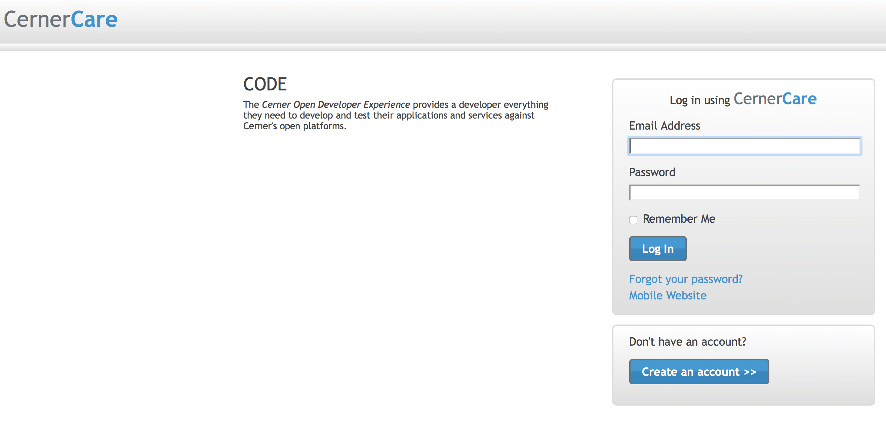
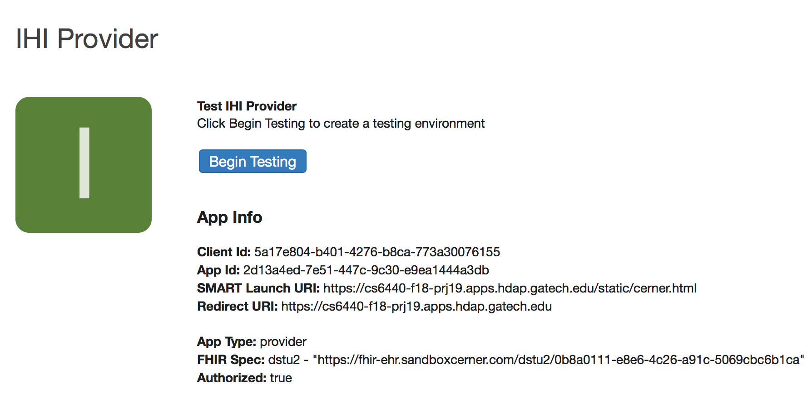
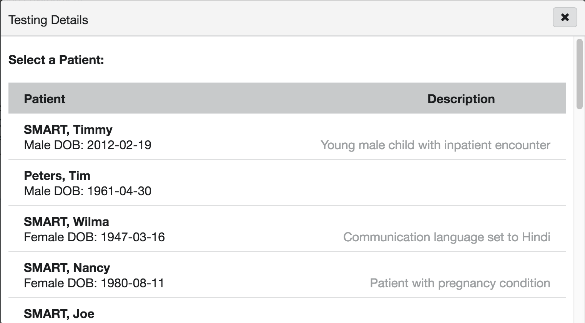
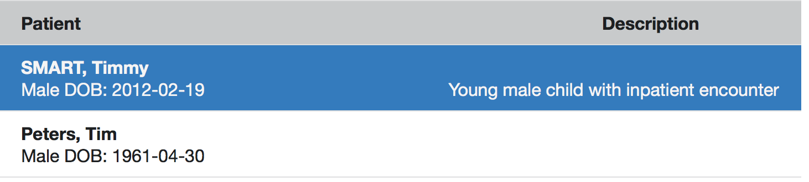
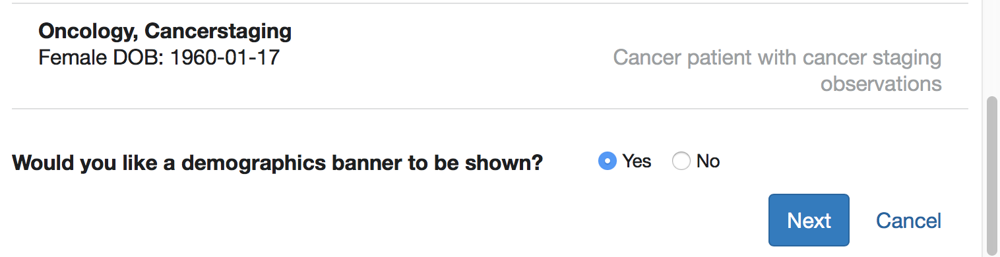
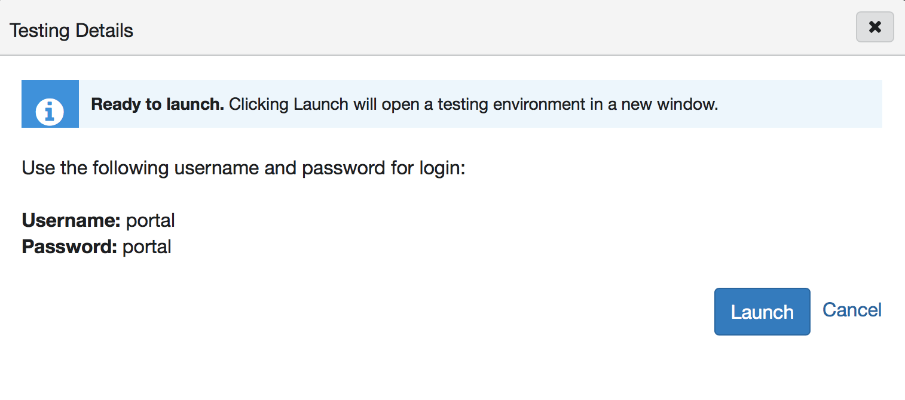
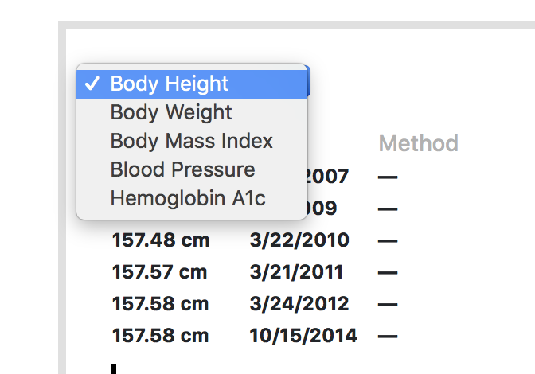

# Special Instructions
This document provides instructions on how to use the application.

## Step 1:
* Go to this URL <https://code.cerner.com/developer/smart-on-fhir/apps/2d13a4ed-7e51-447c-9c30-e9ea1444a3db> 

* You will be directed to the following screen

* Provide the user name and password as the following.  
__UserName:__ uditsarin@gatech.edu  
__Password:__ Letme1n!! 

   

## Step 2:
* Once you are logged in, you will see the following page 

* Click on the BeginTesting button 
* You will see the following screen

## Step 3:
* Click on any patient

*  Scroll down and click on the "Next button" (see below for the screenshot)

## Step 4:
* The following screen should appear 

* click on the Launch button

## Step 5:
* You will be directed to Cerner login Page as shown below

* Provide __username:__ portal  
and __password:__ portal

## Step 6:
* You will now see the main Dashboard of our project (as shown below) 

* You could scroll down and check all the different information present
* You could also select different observations from the combo box as shown 
* 

